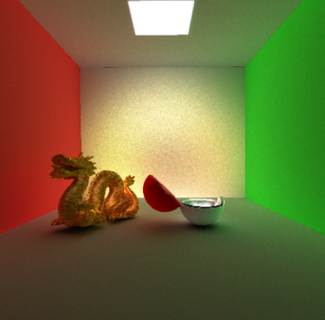
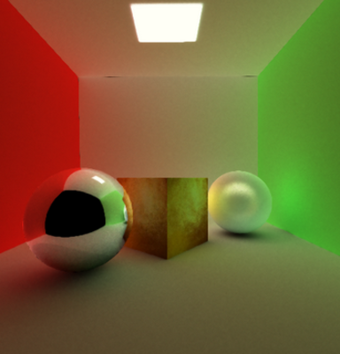
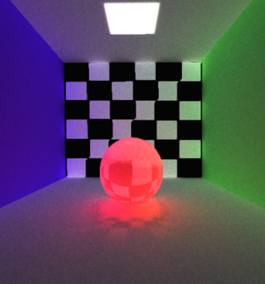
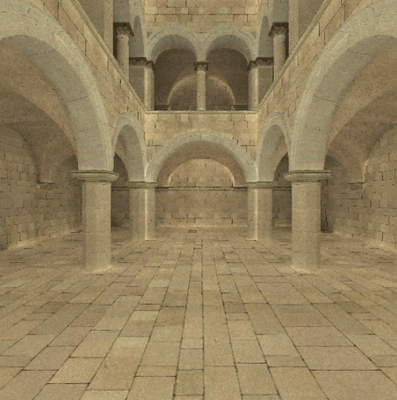

## Implementation of path tracing in c++

1. make -j 
2. ./main path-to-json rays depth windows-filter out-file

# Some examples of rendering scenes

# Features
1. Lambert BRDF
2. Cook-torrance BRDF
3. Handmade bi-directional path tracing (all rays go to lights if max depth has been reached)
4. Perfect reflection + refraction
5. Speed up with kd-tree + Multi threading + Vectorization 
